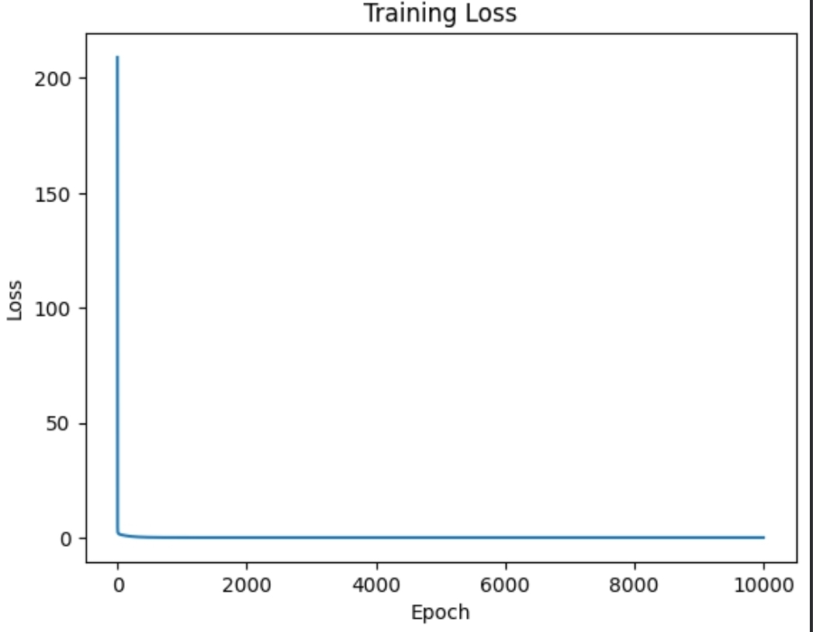

# 📈 My Linear Regression Library

A Linear Regression model built completely from scratch using NumPy and Gradient Descent.

## 🚀 Features

- Linear Regression from scratch
- Gradient Descent
- Prediction
- Mean Squared Error (MSE)
- R² Score
- Comparison with scikit-learn

## 📦 Installation

```bash
pip install -r requirements.txt
```

## 💻 Usage

```bash
python main.py
```

## 📁 Project Structure

```
My_LinearRegression_library/
│
├── linear_regression.py
├── metrics.py
├── main.py
├── README.md
└── requirements.txt
```

## 📈 Graph 



## 🔮 Future Improvements

- Mini-Batch Gradient Descent
- Regularization (L1 & L2)
- Model Saving and Loading
- Polynomial Regression

## 👨‍💻 Author

GitHub: https://github.com/m1deey
